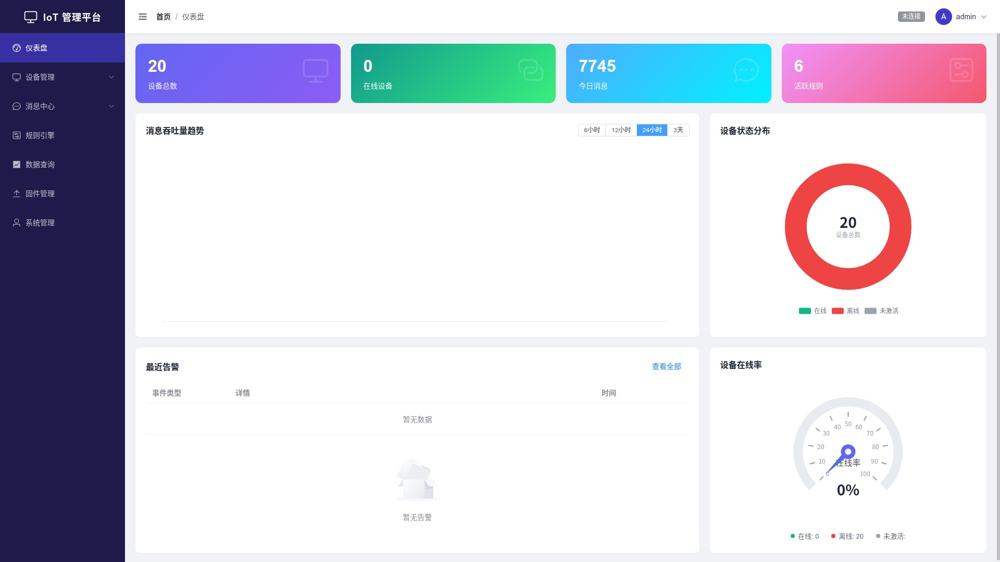
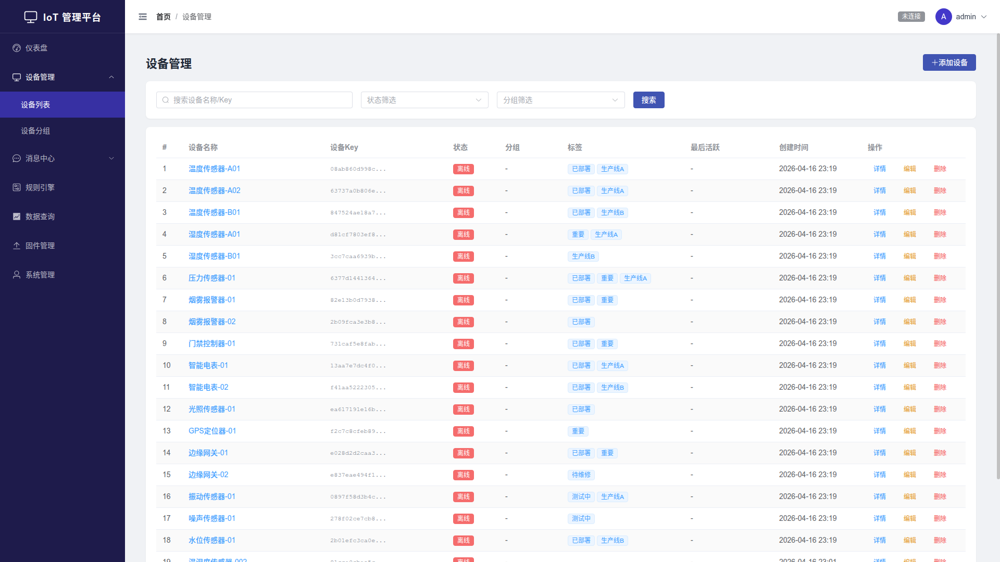
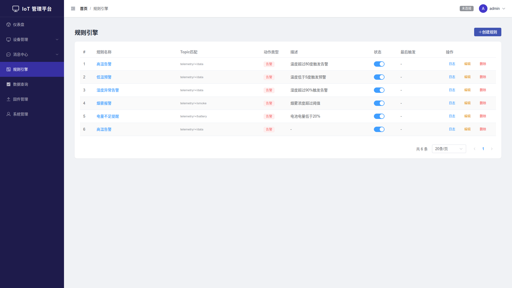
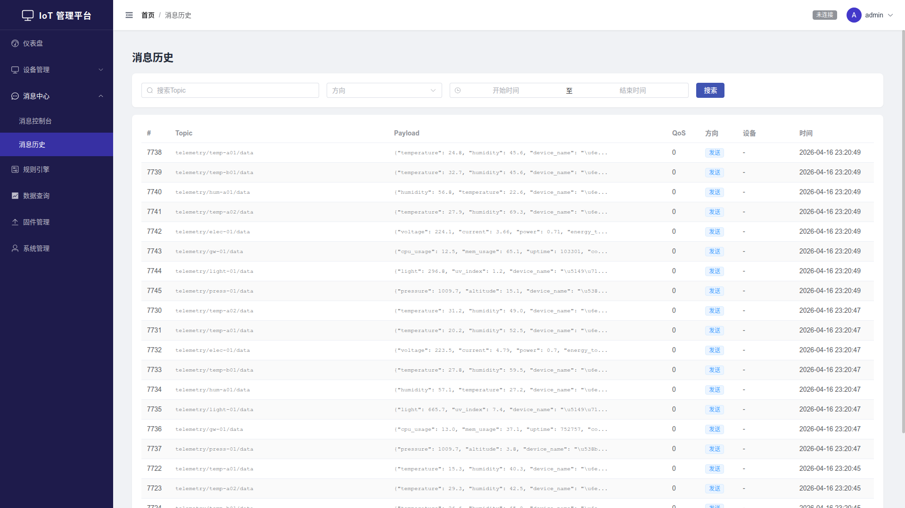
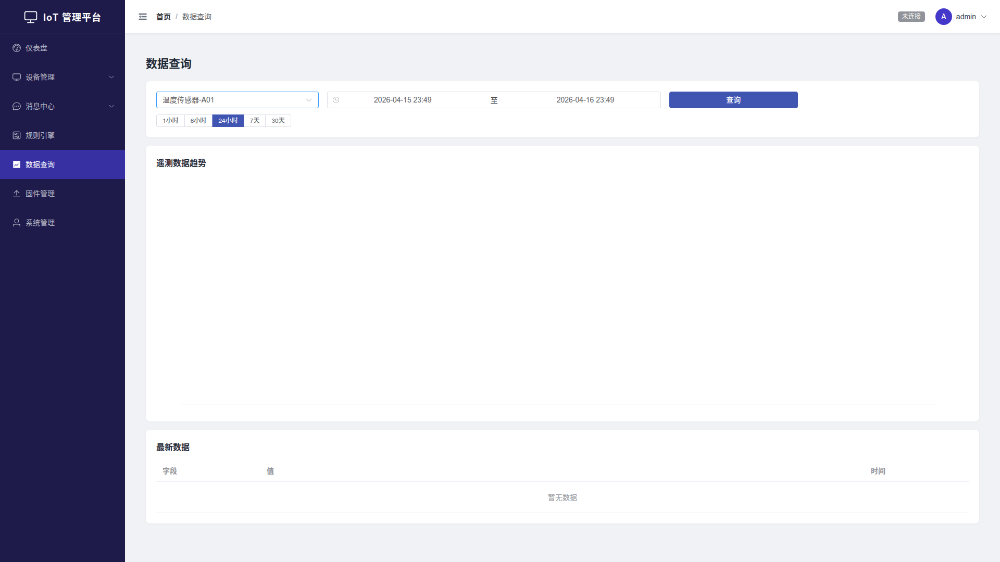
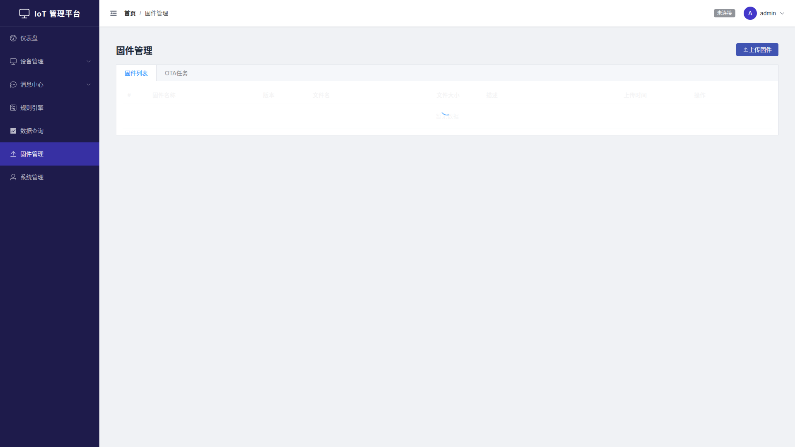

<div align="center">

# IoT Admin Platform

**IoT Device Management & Monitoring System**

A full-stack MQTT-based IoT management platform with embedded MQTT Broker, device management, rule engine, real-time data visualization, and firmware OTA upgrades

English | **[中文](README.md)**

[](https://go.dev/)
[](https://vuejs.org/)
[](https://www.typescriptlang.org/)
[](https://www.sqlite.org/)
[](https://mqtt.org/)
[](LICENSE)

</div>

---

## Screenshots

<table>
<tr>
<td width="50%"></td>
<td width="50%"></td>
</tr>
<tr>
<td align="center"><b>Dashboard</b> - Real-time stats, throughput trends, device status</td>
<td align="center"><b>Device Management</b> - List, search, filter, groups & tags</td>
</tr>
<tr>
<td width="50%"></td>
<td width="50%"></td>
</tr>
<tr>
<td align="center"><b>Rule Engine</b> - Topic matching, condition eval, alert triggers</td>
<td align="center"><b>Message History</b> - Query, topic search, date filtering</td>
</tr>
<tr>
<td width="50%"></td>
<td width="50%"></td>
</tr>
<tr>
<td align="center"><b>Telemetry</b> - Trend charts, time range selector</td>
<td align="center"><b>Firmware OTA</b> - Upload, checksum, batch upgrades</td>
</tr>
</table>

---

## Architecture

```
┌──────────────┐     ┌───────────────────────────────────────────┐
│              │     │            IoT Admin Server                │
│  IoT Devices │     │                                           │
│  (MQTT 5.0)  ├────►│  ┌─────────────┐   ┌──────────────────┐  │
│              │     │  │ Mochi MQTT  │   │   Rule Engine     │  │
│  Temperature │ TCP │  │   Broker    ├──►│  Topic Matching   │  │
│  Humidity    ├────►│  │  :1883      │   │  Condition Eval   │  │
│  Pressure    │ WS  │  │  :8083      │   │  Alert/Publish    │  │
│  GPS ...     ├────►│  └──────┬──────┘   └──────────────────┘  │
│              │     │         │                                  │
└──────────────┘     │  ┌──────▼──────┐   ┌──────────────────┐  │
                     │  │  OnPublish  │   │  WebSocket Hub   │  │
┌──────────────┐     │  │    Hook     ├──►│  Real-time Push  │  │
│              │     │  └──────┬──────┘   └────────┬─────────┘  │
│   Browser    │     │         │                    │            │
│  (Vue 3 SPA) │◄────│  ┌──────▼──────┐            │            │
│              │ WS  │  │   SQLite    │            │            │
│  Dashboard   ├────►│  │  (WAL mode) │            │            │
│  Console ... │ API │  └─────────────┘            │            │
│              ├────►│                              │            │
└──────────────┘     │  ┌───────────────┐  ┌───────▼─────────┐  │
                     │  │  Gin REST API │  │  Static Files   │  │
                     │  │  :8080        │  │  (Vue SPA)      │  │
                     │  └───────────────┘  └─────────────────┘  │
                     └───────────────────────────────────────────┘
```

---

## Tech Stack

| Layer | Technology | Description |
|-------|-----------|-------------|
| **Backend** | Go 1.23 + Gin | High-performance HTTP framework |
| **MQTT Broker** | [Mochi MQTT v2](https://github.com/mochi-mqtt/server) | Embedded broker, TCP + WebSocket |
| **Database** | SQLite (WAL) | Zero-config, single-file deployment |
| **Frontend** | Vue 3 + TypeScript + Element Plus | SPA with component auto-import |
| **Charts** | ECharts | Real-time data visualization |
| **State** | Pinia | Vue 3 state management |
| **Auth** | JWT + bcrypt | Role-based access control |
| **Deploy** | Single Binary | Go embeds Vue SPA static files |

---

## Features

### Device Management
- Device CRUD with auto-generated credentials (Key/Secret)
- Device grouping with hierarchical tree structure
- Flexible tagging system with custom colors
- Online/offline status tracking via MQTT hooks
- Rich metadata support (location, model, firmware version)

### MQTT Broker
- Embedded Mochi MQTT v2, no external dependency
- TCP (`:1883`) + WebSocket (`:8083`) dual protocol
- Device authentication via Key/Secret
- Auto online/offline status on connect/disconnect
- Message interception via OnPublish hook

### Rule Engine
- Topic wildcard matching (`telemetry/+/data`)
- Condition evaluation: `gt`, `gte`, `lt`, `lte`, `eq`, `neq`, `contains`
- Actions: Alert notification, MQTT publish, HTTP forward
- Configurable cooldown period per rule
- Rule execution log with trigger history

### Real-time Dashboard
- 4 KPI stat cards (total devices, online, messages today, active rules)
- Message throughput trend chart (6h/12h/24h/3d)
- Device status distribution pie chart
- Recent alerts table

### Telemetry & Messages
- Real-time message console via WebSocket
- Message history with topic search and date filtering
- Telemetry data query with time range selector
- Quick time range buttons (1h/6h/24h/7d/30d)

### Firmware OTA
- Firmware upload with SHA256 checksum verification
- Batch OTA upgrade task creation
- Upgrade progress and status tracking
- Firmware download endpoint

### System
- JWT authentication with token refresh
- RBAC: Admin / Operator / Viewer roles
- User management (CRUD, password reset)
- CORS support for cross-origin access

---

## Quick Start

### Prerequisites

- Go 1.23+ (with CGO enabled for SQLite)
- Node.js 18+
- npm

### 1. Clone & Install

```bash
git clone https://github.com/justa-cai/iot_admin_platform.git
cd iot_admin_platform

# Install frontend dependencies
cd frontend && npm install && cd ..
```

### 2. Start Development

```bash
# Terminal 1 - Backend (API :8080 + MQTT :1883 + WS :8083)
make backend-dev

# Terminal 2 - Frontend (Vite dev server :5173)
make frontend-dev
```

Open http://localhost:5173 and login with `admin` / `admin123`

### 3. Production Build

```bash
make build
./iot-admin-server
```

Single binary serves API + MQTT + static frontend on port `:8080`.

### 4. Seed Demo Data

```bash
python3 loadtest/seed_demo.py
```

This populates the database with 20 devices, 5 groups, 7 tags, 6 rules, and 4 users.

---

## Project Structure

```
iot_admin/
├── backend/
│   ├── cmd/server/main.go           # Entry point
│   ├── internal/
│   │   ├── api/                     # Gin handlers + middleware
│   │   │   ├── handler/             # Auth, Device, Rule, Dashboard...
│   │   │   ├── middleware/          # JWT auth, CORS
│   │   │   └── router.go           # API route definitions
│   │   ├── config/                  # Viper config management
│   │   ├── model/                   # Data models
│   │   ├── mqtt/                    # Mochi broker + hooks
│   │   ├── rule/                    # Rule engine (matching + actions)
│   │   ├── store/sqlite/            # SQLite data access layer
│   │   └── ws/                      # WebSocket hub
│   ├── config.yaml
│   └── go.mod
├── frontend/
│   ├── src/
│   │   ├── api/                     # Axios API clients
│   │   ├── components/              # StatCard, LineChart, GaugeChart
│   │   ├── composables/             # useWebSocket, useECharts
│   │   ├── layouts/                 # AdminLayout, AuthLayout
│   │   ├── router/                  # Vue Router config
│   │   ├── stores/                  # Pinia stores
│   │   ├── styles/                  # Global SCSS theme
│   │   ├── types/                   # TypeScript interfaces
│   │   └── views/                   # Page components
│   └── vite.config.ts
├── clients/
│   ├── go/                          # Go MQTT publisher/subscriber
│   └── python/                      # Python MQTT publisher/subscriber
├── loadtest/
│   ├── main.go                      # Go concurrent load test
│   ├── seed_demo.py                 # Demo data seeder
│   └── demo_sim.py                  # Device simulator
├── docs/screenshots/                # UI screenshots
├── Makefile
└── .gitignore
```

---

## API Endpoints

| Method | Path | Description |
|--------|------|-------------|
| **Auth** | | |
| POST | `/api/v1/auth/login` | Login, returns JWT |
| POST | `/api/v1/auth/register` | Register (admin only) |
| GET | `/api/v1/auth/profile` | Current user info |
| **Devices** | | |
| GET/POST | `/api/v1/devices` | List / Create devices |
| GET/PUT/DELETE | `/api/v1/devices/:id` | Get / Update / Delete |
| **Groups & Tags** | | |
| CRUD | `/api/v1/groups` | Group management |
| CRUD | `/api/v1/tags` | Tag management |
| **Messages** | | |
| POST | `/api/v1/messages/publish` | Publish MQTT message |
| GET | `/api/v1/messages/history` | Message history |
| GET | `/api/v1/messages/topics` | Topic tree |
| **Rules** | | |
| CRUD | `/api/v1/rules` | Rule management |
| PUT | `/api/v1/rules/:id/enable` | Enable/disable rule |
| GET | `/api/v1/rules/:id/logs` | Rule execution logs |
| **Telemetry** | | |
| GET | `/api/v1/telemetry` | Query telemetry data |
| GET | `/api/v1/telemetry/latest` | Latest data per device |
| **Dashboard** | | |
| GET | `/api/v1/dashboard/stats` | Statistics overview |
| GET | `/api/v1/dashboard/throughput` | Throughput chart data |
| **Firmware** | | |
| POST | `/api/v1/firmware/upload` | Upload firmware |
| GET | `/api/v1/firmware/:id/download` | Download firmware |
| POST | `/api/v1/ota` | Create OTA upgrade |
| **WebSocket** | | |
| WS | `/api/v1/ws` | Real-time event stream |

---

## Load Test Results

100 concurrent devices, 500ms publish interval:

```
=== Final Results ===
Duration:        30.9s
Total Published: 5,943
Total Errors:    0
Avg Publish Rate: 192 msg/s
Connected:       100 / 100
```

```bash
# Run your own load test
make loadtest

# Custom parameters
NUM_DEVICES=200 MSG_INTERVAL_MS=200 DURATION_SECS=60 make loadtest
```

---

## IoT Client Examples

### Go Publisher

```go
opts := mqtt.NewClientOptions().AddBroker("tcp://localhost:1883")
opts.SetUsername("your-device-key").SetPassword("your-device-secret")
client := mqtt.NewClient(opts)
client.Connect()

payload, _ := json.Marshal(map[string]interface{}{
    "temperature": 25.5,
    "humidity":    60.0,
})
client.Publish("telemetry/device-001/data", 0, false, payload)
```

### Python Subscriber

```python
import paho.mqtt.client as mqtt

client = mqtt.Client()
client.username_pw_set("your-device-key", "your-device-secret")
client.connect("localhost", 1883)

client.subscribe("telemetry/+/data")
client.on_message = lambda c, u, msg: print(msg.payload.decode())
client.loop_forever()
```

---

## Configuration

`backend/config.yaml`:

```yaml
server:
  port: 8080

sqlite:
  path: data/iot_admin.db

mqtt:
  tcp_port: 1883
  ws_port: 8083

jwt:
  secret: your-secret-key
  expire_hours: 24
```

---

## License

[MIT](LICENSE)
